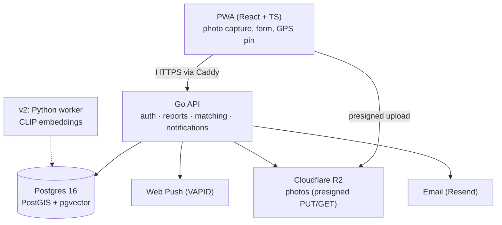

# Architecture

## Overview

A deliberately boring monolith: one Go API, one Postgres database (relational +
geo + vector in a single instance), object storage for photos, and a PWA
frontend. Designed to be **globally correct** (geo-radius matching works
anywhere on Earth) but **launched locally** (single region, single instance).

Caddy sits in front of the API as reverse proxy + automatic TLS. Everything
server-side runs on one VPS via Docker Compose. See `docs/services/infra.md`.

## Key flows

### 1. Submit a report (missing or sighted)

1. User fills the form; browser captures geolocation (`navigator.geolocation`)
   and shows a draggable map pin for correction. EXIF is never trusted
   (ADR-0003).
2. Client resizes the photo (~1600 px main + 320 px thumbnail) and re-encodes
   via canvas — which also strips all metadata, including GPS.
3. Client asks the API for presigned R2 URLs, uploads photos directly.
4. Client POSTs the report. API writes `reports` (public fields) +
   `report_private` (exact location, contact info) in one transaction; a
   trigger derives the fuzzed `approx_location`.
5. API runs the candidate query and returns the top matches immediately —
   the user sees "possible matches" as the final step of the flow.

### 2. Matching (v1: geo + attributes, human-confirmed)

- Candidates = opposite status, state `open`, within radius (default 15 km),
  ranked by: proximity (50%) + breed/size/color overlap (~40%) + recency (10%).
- The reporter reviews thumbnails and taps "this could be it" → creates a
  `matches` row (`pending`) → the *other* party is notified and can confirm
  or reject.
- On `confirmed`: both parties see exact locations and contact info for the
  paired reports; nothing else is ever exposed.
- v2 adds embedding cosine similarity as one more additive scoring term —
  same query shape, no structural change (ADR-0005).

### 3. Auth (magic link)

1. User enters email → API generates a 256-bit random token, stores its
   SHA-256 hash with a 15-minute expiry, emails the link.
2. Clicking the link consumes the token (single-use) and issues an opaque
   session token in an httpOnly/Secure/SameSite=Lax cookie (30-day sliding).
3. Sessions are DB rows → instantly revocable. No passwords, no JWTs
   (ADR-0008).

### 4. Notifications

Fired by the API on match events (suggested → notify counterparty;
confirmed → notify both). Channels: Web Push where a subscription exists,
email always. iOS web push only works for installed PWAs, so email is the
reliability floor, not a fallback nicety.

## Privacy model (load-bearing — see CLAUDE.md principles)

| Data | Table | Who can read |
|---|---|---|
| Dog attributes, photos, fuzzed location | `reports` | everyone |
| Exact location, contact info | `report_private` | owner; counterparty after confirmed match |
| Push subscription keys | `push_subscriptions` | owner only |

Fuzzing is deterministic per report (hash-seeded 100–250 m offset) so repeat
reads can't be averaged back to the true point.

## Scaling notes (for the README, not for building now)

Single Postgres with GiST + (later) vector indexes handles this workload to
hundreds of thousands of reports. The pressure points, in order: photo egress
(mitigated: R2 has free egress), matching query volume (mitigate: index-only
candidate prefilter), push fan-out (mitigate: queue). None are v1 problems.
